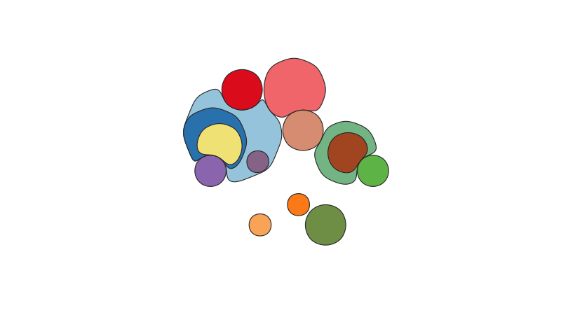
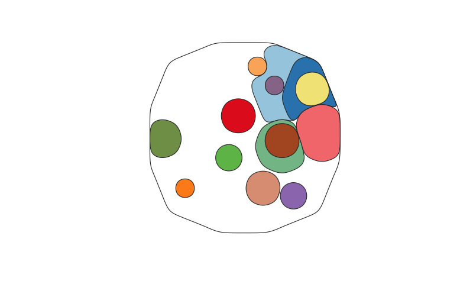
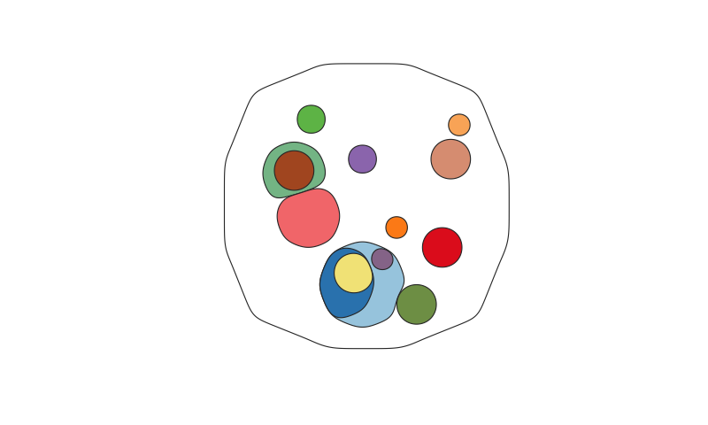

# cloneMap


## Description

A function to map the distribution of somatic clones in sample or set of samples, accounting for the clone size(s), *ie* the Cancer Cell Fraction (CCF), and phylogenetic relationships between clones. Clone positions are semi-randomised in the plot while maintaining the two formally described factors.  


## Installation

You can use devtools::install_github() to install cloneMap from this repository:

`devtools::install_github("amf71/cloneMap")`


## Usage examples - rooted trees

load package:

```R
library(cloneMap)
```

### Example data

`tree_example_1`, `tree_example_2`, `tree_example`, `CCFs_example_1`, `CCFs_example_2`, and `clone_colours_example` are loaded into the R environment (hidden) upon package loading and also are defined below:


Example CCF tables, these could be from the same tumour

```R
CCFs_example_1 <- data.frame( clones = c( 1,   2,   3,   4 ), 
                              CCF    = c( 1, 0.4, 0.2, 0.1 ), 
                              stringsAsFactors = F)

CCFs_example_2 <- data.frame( clones = c( 1,   2,   3,   5,    6,    7,    8,   9,   10 ), 
                              CCF    = c( 1, 0.1, 0.7, 0.2, 0.25, 0.03, 0.06, 0.1, 0.05 ), 
                              stringsAsFactors = F )
```

Example tree matricies are written with each relationship as a row, the parent as the first column and child as the second    


```R
tree_example_1  <-  matrix( c(1, 2,
                              1, 3,
                              2, 4 ), ncol = 2, byrow = TRUE )

tree_example_2  <-  matrix( c(1, 2,
                              1, 3,
                              3, 5,
                              3, 6,
                              3, 7,
                              3, 8,
                              5, 9, 
                              6, 10 ), ncol = 2, byrow = TRUE )

tree_example   <-   matrix( c(1, 2,
                              1, 3,
                              2, 4,
                              3, 5,
                              3, 6,
                              3, 7,
                              3, 8,
                              5, 9, 
                              6, 10 ), ncol = 2, byrow = TRUE )
``` 


Example colours are define using a named vector of hexidecimal colours with clones as names


```R
clone.names <- unique( c( tree_example[,1], tree_example[,2] ) )

clone_colours_example <- c( "#B15928", "#DDD399", "#9471B4", "#ED8F47", "#FDB762", 
                            "#E52829", "#B89B74", "#79C360", "#3F8EAA", "#A6CEE3" ) 

names(clone_colours_example) <- clone.names
```

Additionally a function is provided to make clone colour input objects using a specified RColourBrewer pallete (default = "Paired" palette)

```R
clone.names <- unique( c( tree_example[,1], tree_example[,2] ) )

clone_colours_example_2 <- make_clone_col_input( clone.names )
```

### Plot examples


Simple map:

```R
cloneMap( tree_example_1, CCFs_example_1 )
```


More complex map:

```R
cloneMap( tree_example_2, CCFs_example_2 )
```


Use a clone_map object to  plot cloneMaps reproducably and much faster:
 
```R
clone_map_eg <- cloneMap( tree_example_2, CCFs_example_2, output.Clone.map.obj = TRUE, plot.data = FALSE )
cloneMap( clone_map = clone_map_eg )
```


Specify the same clone colours accross several plots:
 
```R
cloneMap( tree_example, CCFs_example_1, clone.cols = clone_colours_example )
cloneMap( tree_example, CCFs_example_2, clone.cols = clone_colours_example )
```


## Usage examples - unrooted trees

cloneMaps will also plot unrooted trees - i.e. where some clones are not related to each other. This
is common in data derived from normal tissues, rather than tumours, which are dominated by small unrelated
clones. 

If a clone has no parents or daughters it is specified as *clone name* (parent) -> *clone name* (child)
as for clones 1, 2, 9, 10, 11, 12, 13 and 14 in the example below. 


### Example data

Example CCF table for unrooted data

```R
CCF_example_poly <- data.frame( clones = c( 1,   2,    3,   4,    5,    6,    7,    8,    9,   10,     11,   12,    13,   14 ), 
                                CCF    = c( 0.03, 0.05, 0.2, 0.1, 0.02, 0.05,  0.1,  0.05, 0.1, 0.05, 0.02, 0.02, 0.05, 0.03 ), 
                                stringsAsFactors = F )
```

Example tree matrix for unrooted data. Each relationship is specified as a row, the parent as the first column and child as the second    

```R
tree_example_poly <-   matrix( c(1, 1,
                                 2, 2,
                                 3, 4,
                                 3, 5,
                                 4, 6,
                                 7, 8,
                                 9, 9,
                                 10, 10,
                                 11, 11,
                                 12, 12,
                                 13, 13,
                                 14, 14), ncol = 2, byrow = TRUE )

``` 

### Plot examples


plot map of polyclonal data similar to that found in normal tissues

```R
cloneMap( tree.mat = tree_example_poly, 
          CCF.data = CCF_example_poly )
```
          



plot map of polyclonal data similar to that found in normal tissues with border around
the plot area. This makes clearer the % of the tissue containing mutant clones. 

```R
cloneMap( tree.mat = tree_example_poly, 
          CCF.data = CCF_example_poly,
          tissue_border = TRUE)
```




plot map of polyclonal data similar to that found in normal tissues with border with sparsely 
spaced clones. Here `space_fraction` indicates that 70% of the plot area should be white space
indicating that only 70% of cells are wildtype. 

```R
cloneMap( tree.mat = tree_example_poly, 
          CCF.data = CCF_example_poly,
          tissue_border = TRUE,
          space_fraction = 0.7 )
```
       



